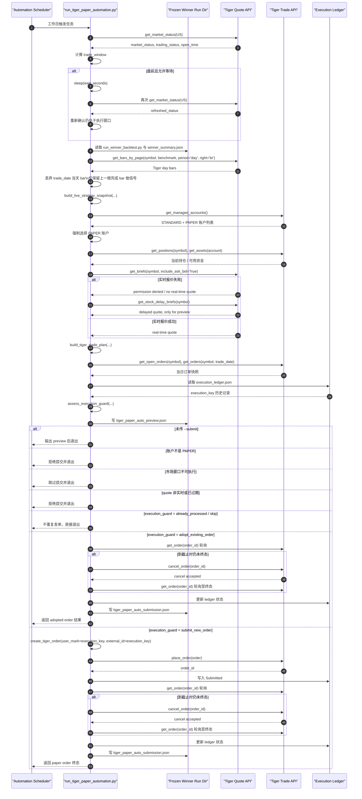

# Tiger Paper Automation Sequence

本文描述 [run_tiger_paper_automation.py](D:/QLib/examples/codex_daily_autoresearch/run_tiger_paper_automation.py) 的当前执行过程。目标是：

- 工作日盘前启动
- 读取冻结的日线赢家策略
- 只用 Tiger 数据重建“上一根完成日线 bar”的开盘信号
- 如有交易信号，只在美股常规开盘后 15 分钟内向 Tiger `PAPER` 账户执行
- 通过 `execution_key + Tiger 订单查询 + 本地 ledger` 避免重复发单

## 调度假设

- Automation 调度时间：工作日 `21:20 Asia/Shanghai`
- 脚本内部市场时区：`America/New_York`
- 常规开盘：`09:30 America/New_York`
- 执行窗口：开盘后 `15` 分钟
- 盘前最大等待：`180` 分钟

调度时间不是最终提交时间。脚本会先读取 Tiger 的市场状态，再决定是否等待到开盘、是否还能在执行窗口内处理订单。

## 参与者

- `Automation Scheduler`
- `run_tiger_paper_automation.py`
- `Frozen Winner Run Dir`
- `Tiger Quote API`
- `Tiger Trade API`
- `Execution Ledger`

## 时序图

## 关键判断点

### 1. Tiger-only 数据链路

自动执行路径不再读取 Qlib provider，也不再 fallback 到 Yahoo。

- 历史日线：`Tiger Quote API.get_bars_by_page(..., period='day', right='br')`
- 执行报价：`Tiger Quote API.get_briefs(..., include_ask_bid=True)`
- 若实时权限不可用，仅允许写 preview；不会用延时报价执行真实模拟单

### 2. 信号语义

信号固定为：

- 使用上一根完成的日线 bar
- 为下一交易日常规开盘生成 `buy / sell / hold`
- 当前 `trade_date` 当天 bar 即使 Tiger 返回，也会被裁掉，不参与信号

### 3. 开盘窗口执行

脚本分两阶段：

1. 盘前阶段只判断市场状态和等待时间
2. 开盘后阶段才重新抓：
   - Tiger 日线
   - Tiger 账户
   - Tiger 未成交单 / 当日订单
   - Tiger 执行报价

因此不会复用盘前的资金、持仓或订单快照。

### 4. 重复发单保护

稳定幂等键：

- `execution_key = {paper_account}:{symbol}:{strategy_name}:{trade_date}:{signal_bar_date}:{action}`

提交前会同时检查：

- 本地 `execution_ledger.json`
- Tiger `get_open_orders`
- Tiger `get_orders`

规则：

- 同 `execution_key` 的 open order：接管，不新发单
- 同 `execution_key` 的已完成订单：视为本次任务已处理
- 发现非本次 `execution_key` 的残留 open order：直接跳过，不自动叠加

### 5. 订单终态

脚本不会只发单一次就结束。提交后会轮询 `get_order(order_id)`：

- 终态：`Filled / Cancelled / Invalid / Inactive`
- 若到截止时间仍未终态，会先 `cancel_order`
- 若撤单前已有部分成交，最终状态会记为 `PartialFillCancelled`

## 输出文件

预览阶段一定会生成：

- `tiger_paper_auto_preview.json`
- `execution_ledger.json`

提交或接管已有订单后额外生成：

- `tiger_paper_auto_submission.json`

这些文件默认写在：

- `<strategy_run_dir>/tiger_paper_auto/`

## 典型路径

### 路径 A: 盘前启动，开盘后发单

1. 定时任务启动
2. Tiger 返回 `NOT_YET_OPEN`
3. 脚本等待到常规开盘
4. 开盘后重新抓 Tiger 数据、账户、报价和订单
5. 若仍在 15 分钟窗口，且有实时行情与可执行信号，则提交并轮询到终态

### 路径 B: 实时报价权限不可用

1. 定时任务启动
2. Tiger 实时报价接口拒绝
3. 脚本可写 preview，但 `trade_plan.can_submit = false`
4. 不会提交模拟单

### 路径 C: 同一信号重复触发

1. 脚本生成相同 `execution_key`
2. Tiger 或 ledger 中已经存在该 key 的订单记录
3. 脚本接管已有单或直接退出，不再重复发单

## 对应实现文件

- 调度入口：[run_tiger_paper_automation.py](D:/QLib/examples/codex_daily_autoresearch/run_tiger_paper_automation.py)
- 单次入口：[run_tiger_paper_entry.py](D:/QLib/examples/codex_daily_autoresearch/run_tiger_paper_entry.py)
- Tiger-only 数据、信号、下单、ledger：[tiger_bridge.py](D:/QLib/examples/codex_daily_autoresearch/tiger_bridge.py)
